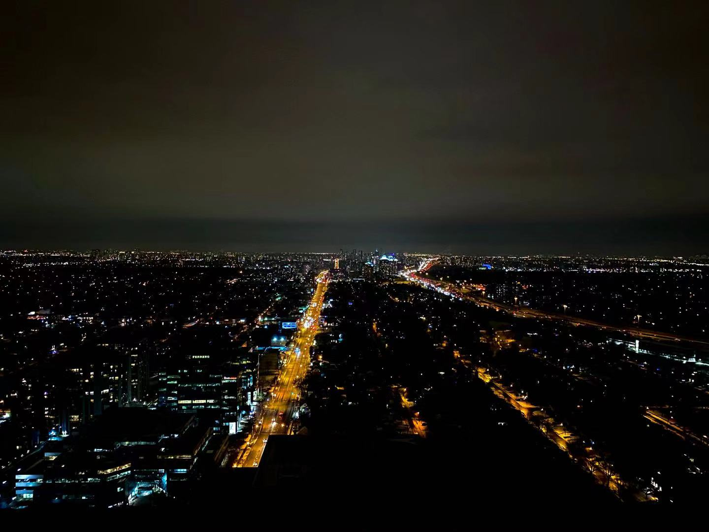

**About Me**

I'm currently a student at the University of Toronto interested in urban planning and data analytics. I've always been interested in cities and learning more about urban spaces through my classes and work experiences have been really fascinating. My interest in statistics and data analytics is something that was fueled by my courses in university and increasingly through how data can play a role in urban planning. 

Skills

Work Experiences 

